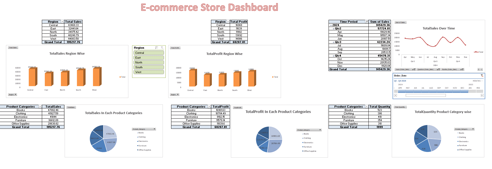

# 🛒 E-commerce Dashboard

An interactive dashboard to analyze sales, profit, and quantity across regions, product categories, and time periods.

## 📊 Key Features
- Total Sales & Profit by Region
- Sales & Profit by Product Category
- Sales Trend Over Time (Q2–Q4 2024)
- Quantity Sold by Category
- Interactive filters for Region, Category, and Time

## 🛠 Tools Used
- Excel (Pivot Tables, Charts, Slicers)

## 📌 Insights
- Highest Sales: Books Category
- Top Region: Central
- Sales trends show quarterly cycles

## 📷 Preview

